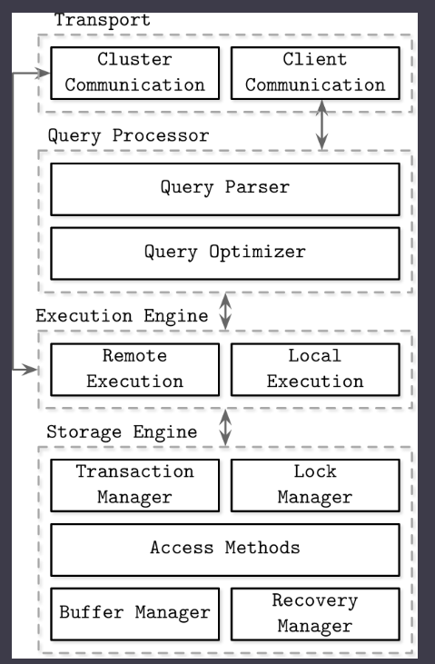

# Database Internals

_source_: https://learning.oreilly.com/library/view/database-internals/9781492040330/

- Introduction
  - There are many ways to classify a DBMS
    - by storage medium - memory vs disk based
    - by data layout - row oriented vs column oriented
    - by other terms like key-value store, document-oriented database, graph database etc
- DBMS architecture
  - DBMS follow client-server model
    
- Memory vs Disk based DBMS
  - In-memory database primarily store data in memory and use disk for recovery and logging.
  - Disk based DBMS stores most of the data on disk and use memory for caching disk content or as temporary storage
  - The data structure, organization and optimization techniques vary between in-memory and disk based DBMS
  - Disk based storage structure often have a short and wide tree
  - Programming for main memory is significantly simpler than doing so for disk for which you have to manage data reference, serialization format, freed memory and segmentation manually
  - Random memory access is significantly faster in memory
  - Handling variable size data in disk requires special attention
  - In memory database uses WAL and disk backup for data persistence.
    - Data is written to in memory and then to WAL. From WAL data is backed up in disk in batches
- Data Files
  - AKA primary files
  - Can be implemented as
    - Index organized tables (IOT)
      - data records are stored in the index itself
    - Heap-organized tables (heap files)
      - records don't follow any particular order
      - require additional index stucture to make records searchable
    - Hash-organized tables (hashed files)
      - records stored in buckets
      - hashed value of key determines which bucket a record belongs to
      - within the bucket reocrds can be sotred in append order or sorted by key to improve lookup speed
- Index files
  - an index on primary file is called primary index
  - all other indexes are called secondary
  - secondary indexes
    - TODO need to read again
  - clustered index
    - if the order of data records follows the search key order
    - TODO need to read again
- Many DB has inherent and explicit primary key
  - If the PK is not specified, the storage engine can create an implicit primary key
    - Example MySQL InnoDB
- storage structure
  - Buffering
    - whether or not storage structure chooses to collect

## Action Items

TODO: Learn about how the disks work
